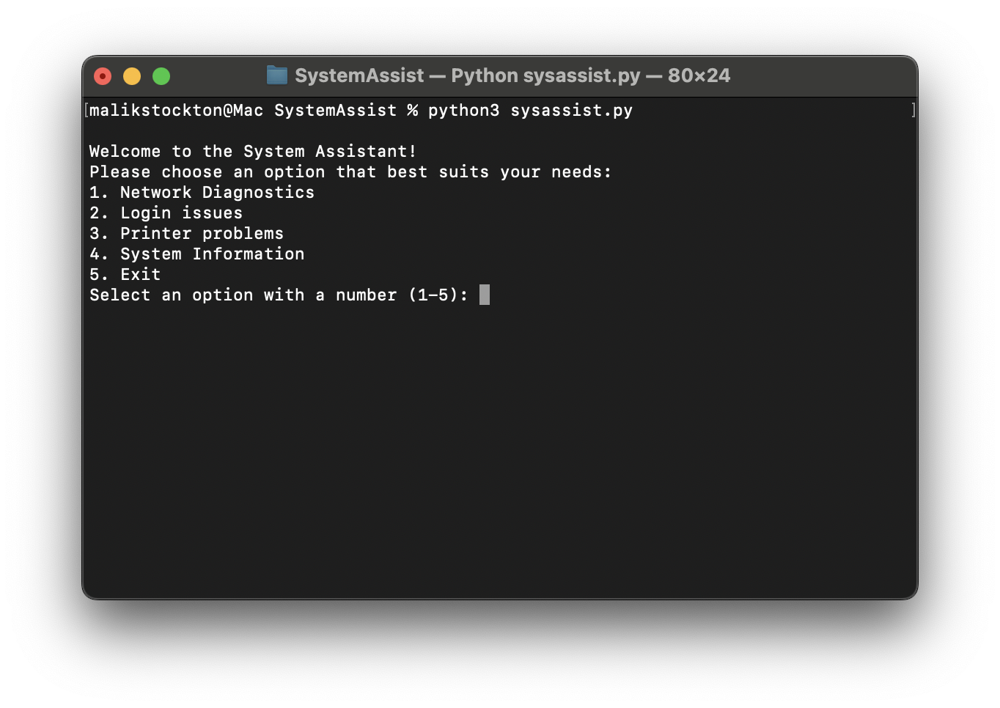

# SystemAssist V1.1
A cross-platform command line tool for help desk troubleshooting automation.

## Navigation
- [Security Practices](#security-practices)
  - [Input Validation & Sanitization](#input-validation--sanitization)
  - [Error Handling & Information Disclosure Prevention](#error-handling--information-disclosure-prevention)
  - [Subprocess Security](#subprocess-security)
  - [Logging & Monitoring](#logging--monitoring)
- [Prerequisites](#prerequisites)
- [Features](#features)
- [Module Breakdown](#module-breakdown)
- [Installation](#installation)
- [Usage](#usage)
- [Contributing](#contributing)
- [License](#license)
- [Troubleshooting](#troubleshooting)
- [Changelog](#changelog)
- [Support](#support)
- [Project Structure](#project-structure)

## Security Practices
### Note: This tool is intended for local diagnostics. If deployed in shared or remote environments, additional hardening is recommended.
This project implements several security best practices to protect against common vulnerabilities:

### Input Validation & Sanitization
- **Input Length Validation**: Input is restricted to prevent resource exhaustion and ensure proper validation.
- **Pattern Matching**: Regular expressions detect and block potentially malicious input patterns.
- **Type Validation**: Strict validation ensures only expected data types are accepted.

### Error Handling & Information Disclosure Prevention
- **Generic Error Messages**: User-facing errors are generic to prevent information leakage.
- **Secure Logging**: Detailed error information is logged securely for administrators.
- **Consistent Messaging**: Error messages are consistent and informative without revealing sensitive details.

### Subprocess Security
- **No Shell Injection**: Commands are executed without shell=True to prevent injection.
- **Privilege Awareness**: Warnings for operations that may require elevated privileges.
- **Safe Command Execution**: Input is sanitized and validated before being used in system commands.
- **Cross-Platform Awareness**: SystemAssist detects the operating system (Windows, macOS, Linux) to adapt functionality accordingly.

### Logging & Monitoring
- **Security Event Logging**: All security-related events are logged with timestamps.
- **Attempt Limiting**: Limits user input attempts to prevent misuse.
- **Interruption Handling**: Graceful handling of keyboard interrupts and EOF.

## Prerequisites

### System Requirements
- **Operating System**: Windows 10+ / macOS 10.12+ / Linux (Ubuntu 18.04+, CentOS 7+, etc.)
- **RAM**: Minimum 2GB
- **Storage**: 100MB free space
- **System Tools**: ping, whoami/id (Windows), lpstat (Linux/macOS printing)
- **Network**: Internet connectivity for network diagnostics
- **Permissions**: Administrative privileges may be required for some functions

### Python 3.6+
SystemAssist requires Python 3.6 or higher.

#### Windows Installation
1. Download Python from [python.org](https://www.python.org/downloads/)
2. Run the installer (.exe file)
3. **Important**: Check "Add Python to PATH" during installation
4. Verify installation: Open Command Prompt and run:
   ```bash
   python --version
   ```

#### macOS Installation
1. Using Homebrew (recommended):
   ```bash
   brew install python
   ```
2. Or download from [python.org](https://www.python.org/downloads/)
3. Verify installation: Open Terminal and run:
   ```bash
   python3 --version
   ```

#### Linux Installation
1. Ubuntu/Debian:
   ```bash
   sudo apt update
   sudo apt install python3 python3-pip
   ```
2. CentOS/RHEL (7 and earlier):
   ```bash
   sudo yum install python3 python3-pip
   ```
3. CentOS/RHEL (8+) / Fedora:
   ```bash
   sudo dnf install python3 python3-pip
   ```
4. Arch Linux:
   ```bash
   sudo pacman -S python python-pip
   ```
5. Verify installation: Run:
   ```bash
   python3 --version
   ```

### Git
Required for cloning the repository.

#### Windows Installation
1. Download Git from [git-scm.com](https://git-scm.com/download/win)
2. Run the installer (.exe file)
3. Use default settings (recommended for beginners)
4. Verify installation: Open Command Prompt and run:
   ```bash
   git --version
   ```

#### macOS Installation
1. Install Homebrew (if not already installed):
   ```bash
   /bin/bash -c "$(curl -fsSL https://raw.githubusercontent.com/Homebrew/install/HEAD/install.sh)"
   ```

2. Install Git using Homebrew:
   ```bash
   brew install git
   ```

3. Verify installation: Open Terminal and run:
   ```bash
   git --version
   ```

#### Linux Installation
1. Ubuntu/Debian:
   ```bash
   sudo apt update
   sudo apt install git
   ```
2. CentOS/RHEL (7 and earlier):
   ```bash
   sudo yum install git
   ```
3. CentOS/RHEL (8+) / Fedora:
   ```bash
   sudo dnf install git
   ```
4. Arch Linux:
   ```bash
   sudo pacman -S git
   ```
5. Verify installation: Run:
   ```bash
   git --version
   ```

## Features
- **Network Diagnostics** - Tests connectivity by pinging 8.8.8.8
- **User Login Info** - Displays current user information using OS-specific commands
- **Printer Status Check** - Gets printer status using platform tools (PowerShell/CUPS) and provides troubleshooting
- **System Insights** - Displays OS, CPU, memory, and disk usage using psutil, with automatic cleanup suggestions

### Module Breakdown
| Module             | Description                                               |
|--------------------|-----------------------------------------------------------|
| [`network.py`](modules/network.py)     | Runs ping tests to 8.8.8.8, captures output for connectivity check |
| [`login.py`](modules/login.py)         | Displays current user session using 'whoami' (Windows) or 'id' (Linux/macOS) |
| [`printer.py`](modules/printer.py)     | Checks printer status using PowerShell (Windows) or lpstat (Linux/macOS) |
| [`system_info.py`](modules/system_info.py) | Reports OS, CPU, memory, disk usage using psutil; attempts cleanup if disk >60% |
| [`security_logger.py`](modules/security_logger.py) | Logs security events and errors to daily log files in modules/logs/ |

## Installation

1. Clone the repository:
   ```bash
   git clone https://github.com/malik1456/SystemAssist.git
   cd SystemAssist
   ```

2. Install dependencies:
   ```bash
   pip install -r requirements.txt
   ```

3. Make the script executable (Linux/macOS):
   ```bash
   chmod +x sysassist.py
   ```

## Usage

Run the diagnostic tool:
```bash
python3 sysassist.py
```

Or make it executable and run:
```bash
./sysassist.py
```

### Menu Options:


1. **Network Diagnostics** - Test internet connectivity by pinging Google DNS
2. **Login Info** - Display current user information
3. **Printer Status** - Check printer status and configuration
4. **System Information** - View system specs and resource usage
5. **Demo** - View demo screenshot
6. **Exit** - Close the application

## Contributing

1. Fork the repository
2. Create a feature branch (`git checkout -b feature/AmazingFeature`)
3. Commit your changes (`git commit -m 'Add some AmazingFeature'`)
4. Push to the branch (`git push origin feature/AmazingFeature`)
5. Open a Pull Request

## License

This project is licensed under the MIT License - see the [LICENSE](./LICENSE) file for details.

## Troubleshooting

### Common Issues:

**Permission Errors:**
- On macOS/Linux, some commands may require sudo privileges
- The tool will warn you when elevated permissions are needed
- Windows may require running as Administrator for some functions

**Missing System Tools:**
- **ping**: Required for network diagnostics (usually pre-installed)
- **whoami/id**: Required for login info (usually pre-installed)
- **lpstat**: Required for printer status on Linux/macOS (install CUPS)
- Error: "command not found" indicates missing system utilities

**Missing Dependencies:**
- Ensure all Python packages are installed: `pip install -r requirements.txt`
- Only `psutil` is required beyond Python standard library

**Network Issues:**
- The network diagnostic requires internet connectivity
- Firewall settings may block ping requests
- Corporate networks may restrict ICMP traffic

**Unsupported Operating Systems:**
- Tool supports Windows, macOS, and Linux
- BSD variants (FreeBSD, OpenBSD) are not officially supported
- Some Linux distributions may have different package managers

## Changelog

### v1.1.0
- Enhanced security features
- Improved error handling
- Added cross-platform support
- Updated documentation

### v1.0.0
- Initial release
- Basic diagnostic functionality
- Support for Windows, macOS, and Linux

## Support

If you encounter any issues or have questions:
- Open an issue on GitHub
- Check the troubleshooting section above
- Review the security practices documentation

## Project Structure

```
SystemAssist/
├── sysassist.py          # Main CLI application with menu and input validation
├── requirements.txt      # Python dependencies (psutil)
├── README.md             # This file
├── LICENSE               # MIT License
├── .gitignore            # Git ignore rules for cache and logs
├── Demo.png              # Demo screenshot of SystemAssist CLI
└── modules/
    ├── __init__.py       # Module initialization
    ├── network.py        # Network diagnostics (ping 8.8.8.8)
    ├── login.py          # User login information
    ├── printer.py        # Printer status checks and troubleshooting
    ├── system_info.py    # System information display and cleanup
    ├── security_logger.py # Security event logging
    └── logs/             # Directory for log files (created automatically)
